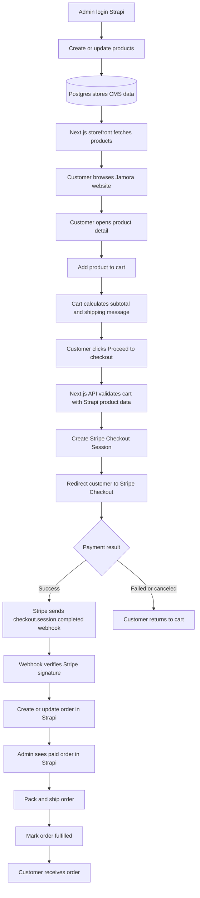
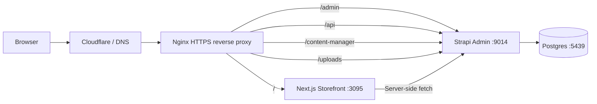
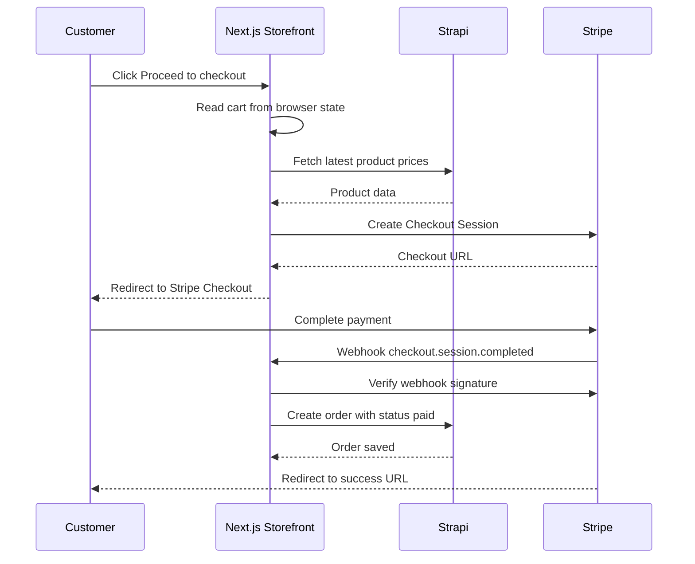

# Jamora - Business Flow & Flowchart

Dokumen ini menjelaskan alur bisnis Jamora dari sisi customer, admin, sistem,
payment, dan fulfillment. Stack saat ini:

| Layer | Tool | Fungsi |
| --- | --- | --- |
| Storefront | Next.js | Website customer, katalog, cart, checkout trigger |
| CMS / Admin | Strapi | Kelola produk, stok, konten, dan order |
| Database | Postgres | Simpan data CMS, produk, order |
| Payment | Stripe Checkout | Pembayaran kartu dan metode lokal yang didukung Stripe |
| Reverse Proxy | Nginx | Routing domain ke storefront dan Strapi |

---

## 1. Business Flow Summary

1. Admin mengelola produk di Strapi.
2. Storefront mengambil data produk dari Strapi.
3. Customer browsing produk di website Jamora.
4. Customer menambahkan produk ke cart.
5. Customer klik checkout.
6. Storefront membuat Stripe Checkout Session.
7. Customer membayar di halaman Stripe.
8. Stripe mengirim webhook ke sistem Jamora.
9. Sistem membuat atau memperbarui order di Strapi.
10. Admin memproses order, packing, shipping, lalu update status.
11. Customer menerima konfirmasi order dan pengiriman.

---

## 2. Customer Flow

| Step | Actor | Action | System Result |
| --- | --- | --- | --- |
| 1 | Customer | Buka website Jamora | Next.js render halaman storefront |
| 2 | Customer | Lihat katalog / detail produk | Storefront fetch produk dari Strapi |
| 3 | Customer | Add to cart | Cart tersimpan di browser |
| 4 | Customer | Buka cart | Total dihitung dari item cart |
| 5 | Customer | Proceed to checkout | Storefront request Stripe Checkout Session |
| 6 | Customer | Bayar di Stripe | Stripe memproses pembayaran |
| 7 | Stripe | Kirim webhook payment success | Sistem mencatat order paid di Strapi |
| 8 | Customer | Redirect ke success page | Customer melihat status order |

---

## 3. Admin Flow

| Step | Actor | Action | System Result |
| --- | --- | --- | --- |
| 1 | Admin | Login ke Strapi Admin | Admin masuk dashboard CMS |
| 2 | Admin | Kelola produk | Product data tersimpan di Postgres |
| 3 | Admin | Cek order baru | Order paid tampil di Strapi |
| 4 | Admin | Packing order | Status bisa diubah menjadi processing |
| 5 | Admin | Input shipment/tracking | Order siap dikirim |
| 6 | Admin | Mark fulfilled | Order selesai |

---

## 4. System Flow

### Current State

- Strapi sudah menjadi CMS utama.
- Storefront sudah fetch katalog dari Strapi.
- Cart sudah jalan di browser.
- Checkout payment belum aktif dan masih perlu implementasi Stripe Checkout.
- Order model sudah disiapkan di Strapi, tapi webhook Stripe belum disambung.

### Target Checkout Flow

1. `POST /api/checkout` menerima cart items dari frontend.
2. API memvalidasi item dan harga dari Strapi, bukan percaya harga dari browser.
3. API membuat Stripe Checkout Session.
4. Browser redirect ke `session.url`.
5. Stripe memanggil webhook `POST /api/stripe/webhook`.
6. Webhook memverifikasi signature Stripe.
7. Jika payment sukses, sistem membuat order di Strapi dengan status `paid`.
8. Customer diarahkan ke success page.

---

## 5. Flowchart - End-to-End Business Flow



---

## 6. Flowchart - Technical Request Routing



---

## 7. Flowchart - Stripe Checkout Sequence



---

## 8. Order Status Lifecycle

| Status | Meaning | Trigger |
| --- | --- | --- |
| `pending` | Order intent created but not paid | Checkout started |
| `paid` | Payment succeeded | Stripe webhook success |
| `failed` | Payment failed | Stripe webhook failure |
| `fulfilled` | Order shipped / completed | Admin update |
| `refunded` | Payment refunded | Admin or Stripe refund event |

---

## 9. Required Environment Variables For Checkout

```bash
NEXT_PUBLIC_SITE_URL=https://jamora.kaumtech.com
NEXT_PUBLIC_STRIPE_PUBLISHABLE_KEY=pk_test_...
STRIPE_SECRET_KEY=sk_test_...
STRIPE_WEBHOOK_SECRET=whsec_...
STRAPI_URL=http://strapi:1337
```

Notes:

- `NEXT_PUBLIC_STRIPE_PUBLISHABLE_KEY` boleh terekspos di browser.
- `STRIPE_SECRET_KEY` dan `STRIPE_WEBHOOK_SECRET` hanya boleh ada di server.
- `STRAPI_URL=http://strapi:1337` dipakai oleh storefront container untuk akses
  Strapi di jaringan Docker internal.

---

## 10. Implementation Checklist

| Item | Status |
| --- | --- |
| Strapi CMS | Done |
| Product content type | Done |
| Product seed | Done |
| Storefront product fetch from Strapi | Done |
| Cart UI and local cart state | Done |
| Public product API access | Done |
| Mock paid checkout for testing | Done |
| Success / cancel pages | Done |
| Browser-based order tracking | Done |
| Simulated email confirmation | Done |
| Stripe Checkout API route | Todo |
| Checkout button integration | Todo |
| Stripe webhook verification | Todo |
| Create paid order in Strapi | Todo |
| Shipping/tracking fields | Later |
