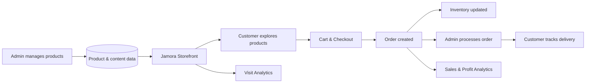

# JAMORA

## Core Feature Presentation

**Premium Indonesian Herbal E-Commerce for Europe**  
*Energi · Digestie · Echlibru*

---

## 1. Product Vision

Jamora membawa jamu premium Indonesia ke pasar Eropa melalui pengalaman belanja yang modern, informatif, dan terpercaya.

- Menggabungkan warisan herbal Indonesia dengan standar pasar Eropa
- Menempatkan transparansi produk sebagai bagian utama pengalaman pelanggan
- Menggunakan mata uang Euro (€) sebagai standar transaksi
- Dibangun sebagai platform commerce sekaligus media brand storytelling

---

## 2. Premium Storefront

Website customer dirancang untuk memperkenalkan brand dan memudahkan proses pembelian.

- Homepage dengan narasi dan identitas premium Jamora
- Katalog produk dengan tampilan responsif
- Halaman detail produk yang informatif
- Navigasi cepat dari eksplorasi produk hingga cart
- Server-side rendering untuk performa dan SEO yang lebih baik

**Value:** pelanggan dapat mengenal manfaat, kualitas, dan cerita produk sebelum membeli.

---

## 3. Three Wellness Pillars

Seluruh katalog disusun berdasarkan tiga kebutuhan utama pelanggan:

| Pillar | Fokus Manfaat |
| --- | --- |
| **Energy** | Mendukung energi dan vitalitas harian |
| **Digestion** | Mendukung kenyamanan dan kesehatan pencernaan |
| **Balance** | Mendukung keseimbangan tubuh dan gaya hidup |

Kategori ini digunakan secara konsisten pada katalog, navigasi, merchandising, dan analitik.

---

## 4. Transparent Product Information

Setiap produk dapat menyajikan informasi penting secara terstruktur:

- Komposisi dan transparansi bahan
- Manfaat utama produk
- Petunjuk konsumsi
- Informasi alergen
- Harga dalam Euro
- Status dan jumlah stok
- Badge sertifikasi seperti Organic, Vegan, EU Compliant, dan GMP

**Value:** meningkatkan kepercayaan pelanggan dan mendukung kebutuhan compliance pasar Eropa.

---

## 5. Cart & Checkout Experience

Alur pembelian dibuat sederhana dari katalog sampai konfirmasi order.

1. Customer memilih produk
2. Produk ditambahkan ke cart
3. Cart menghitung jumlah dan subtotal
4. Customer melanjutkan checkout
5. Sistem mencatat order dan menampilkan halaman konfirmasi

Cart tersimpan di browser sehingga item tetap tersedia saat customer berpindah halaman.

> **Current status:** alur checkout demo sudah tersedia. Integrasi Stripe Checkout dan webhook pembayaran real masih tahap berikutnya.

---

## 6. Content & Product Management

Admin dapat mengelola operasional toko melalui CMS dan dashboard internal.

- Membuat dan memperbarui produk
- Mengatur harga, kategori, deskripsi, dan media
- Mengelola konten storefront
- Melihat daftar produk dan detail order
- Mengubah status order sesuai proses operasional

Perubahan data tersimpan di database dan digunakan oleh storefront sebagai sumber data produk.

---

## 7. Inventory & Order Operations

Platform mendukung proses setelah customer melakukan checkout.

- Tracking stok setiap produk
- Pengurangan stok pada transaksi demo yang berhasil
- Monitoring order dari dashboard admin
- Status order untuk membedakan proses pembayaran dan fulfillment
- Halaman tracking agar customer dapat melihat perkembangan order
- Delivery label untuk membantu proses pengiriman

**Value:** operasional produk, order, dan pengiriman berada dalam satu alur yang terhubung.

---

## 8. Business Analytics

Jamora mencatat data kunjungan dan transaksi untuk memberikan ringkasan performa bisnis.

- Total visits dan visits hari ini
- Jumlah penjualan
- Total omzet dan omzet hari ini
- Estimasi gross profit
- Estimasi margin
- Visualisasi performa pada dashboard admin

Estimasi profit menggunakan rasio biaya yang dapat dikonfigurasi melalui `JAMORA_COST_RATIO`.

**Contoh:** cost ratio 42% menghasilkan estimasi gross margin 58% dari omzet.

---

## 9. Europe-Ready Foundation

Platform disiapkan untuk kebutuhan ekspansi ke pasar Eropa.

- English-first dengan fondasi multi-language
- Dukungan pilihan bahasa pada storefront
- Harga utama dalam Euro (€)
- Cookie consent untuk kebutuhan privasi
- Struktur data compliance dan sertifikasi produk
- Arsitektur headless yang mudah dikembangkan

Target pengembangan pembayaran mencakup kartu, Apple Pay, Google Pay, iDEAL, Klarna/Sofort, dan Bancontact melalui payment gateway.

---

## 10. Core System Flow

---

## 11. Current Product Readiness

An overview of Jamora's core feature readiness based on the current implementation:

| Area | Status | Short Description |
| --- | --- | --- |
| Premium storefront | **Ready** | The customer website is responsive and reflects Jamora's premium brand identity. |
| Product catalog & detail | **Ready** | Customers can browse products, prices, information, and detailed product pages. |
| Three wellness categories | **Ready** | Products are organized into Energy, Digestion, and Balance categories. |
| Browser-based cart | **Ready** | Customers can add products and keep their cart saved in the browser. |
| CMS product management | **Ready** | Admins can create, update, and manage product information. |
| Inventory tracking | **Ready** | Product stock can be monitored and reduced after a successful demo transaction. |
| Order management & tracking | **Ready** | Admins can manage orders, while customers can check their order status. |
| Visit, sales, revenue & profit analytics | **Ready** | The dashboard displays visits, sales, revenue, and estimated profit. |
| Demo checkout flow | **Ready** | The checkout journey can be demonstrated without processing a real payment. |
| Real Stripe payment & webhook | **Next Phase** | Real payments and automatic Stripe confirmations have not been activated yet. |

---

# JAMORA

### Indonesian Heritage. European Standard. Modern Commerce.

**Energi · Digestie · Echlibru**
